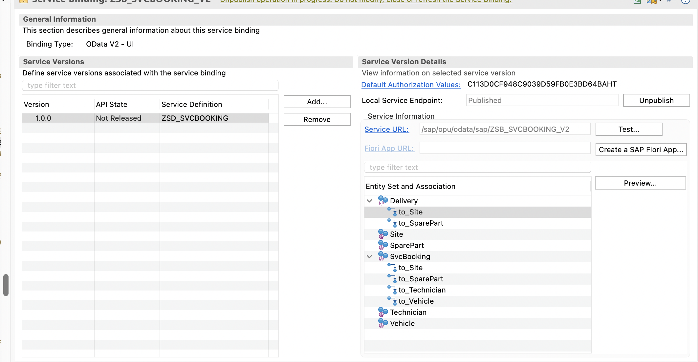
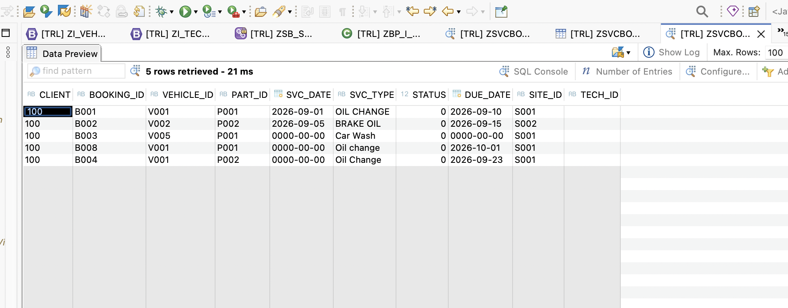
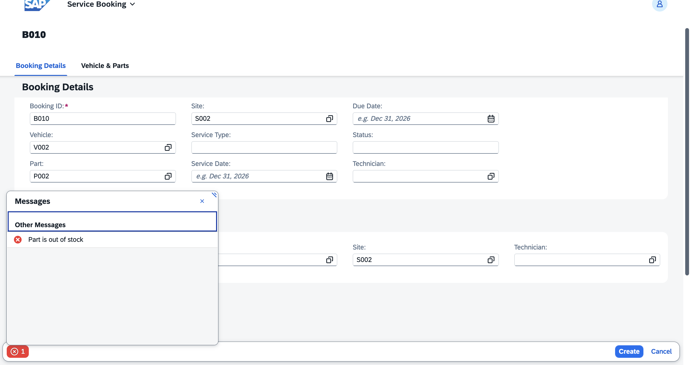
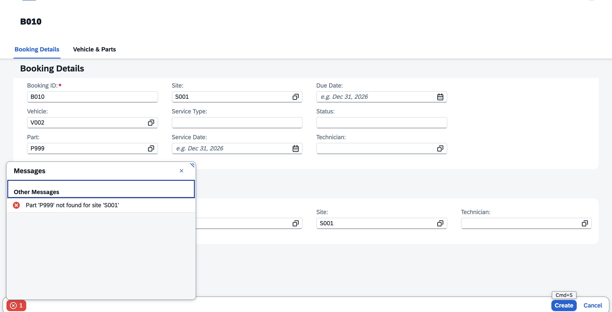
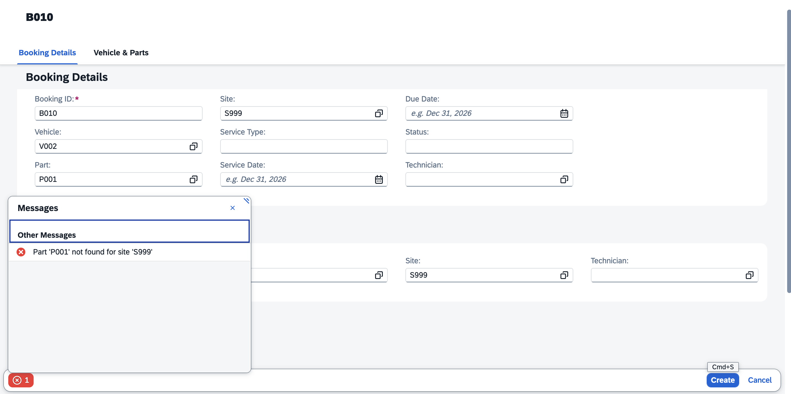
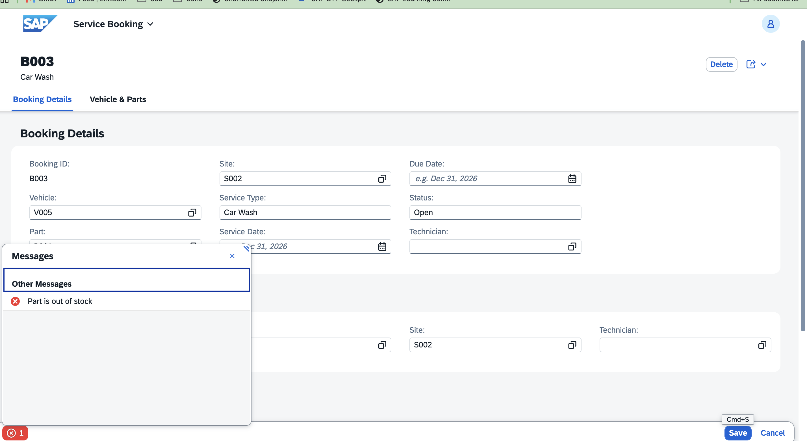
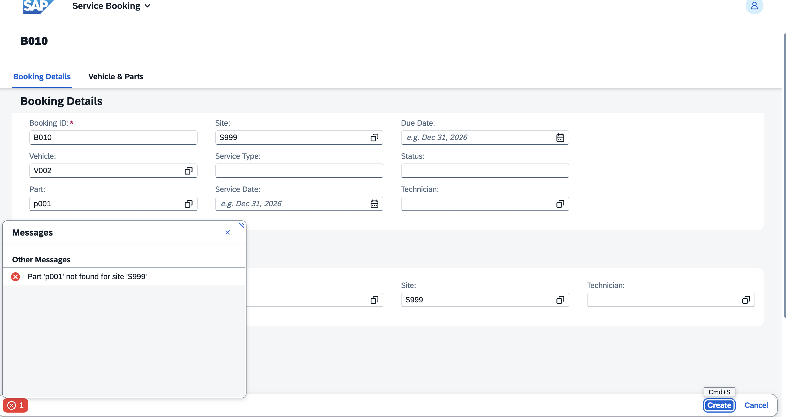
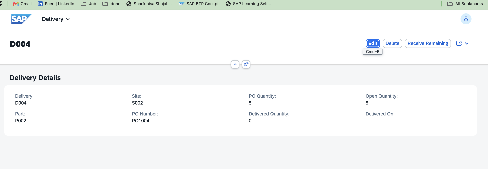
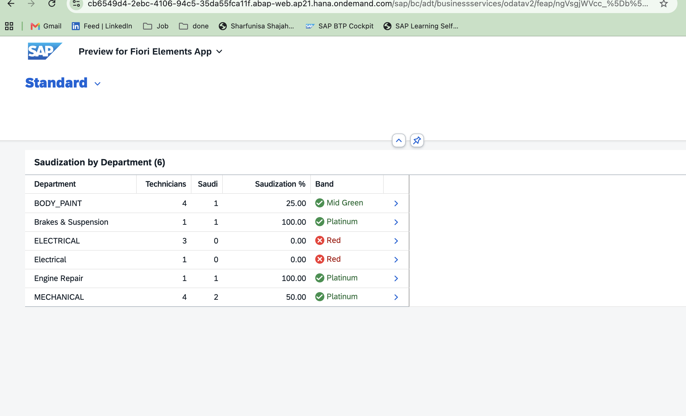

# Route 40 Motors — Service Booking & Aftersales Platform

An automotive aftersales application built on **SAP BTP ABAP Environment** with the **ABAP RESTful Application Programming Model (RAP)**, **CDS** and **SAP Fiori Elements**.

Route 40 Motors models a multi-site car workshop. A customer's vehicle is booked for service, each booking reserves a spare part at a specific site, and the back end refuses the booking if that part is not in stock at that site. The project also tracks parts deliveries and includes a Saudization (Nitaqat-style) workforce report, reflecting the Saudi market it is themed on.

> Sample data in this repository is fictional.

**Author:** Sharfunisa Shajahan · [GitHub](https://github.com/Nishaweb-developer) · [Portfolio](https://nishaweb-developer.github.io/myworks)

---

## What it does

- **Service bookings**: list report and object page with create, edit and delete.
- **Stock validation**: a server-side validation (`checkStock`) blocks a booking when the part does not exist at the chosen site or is out of stock, on both create and edit.
- **Master data**: vehicles, sites, spare parts (stock is kept per part and per site), technicians.
- **Deliveries**: purchase-order quantity, delivered quantity and open quantity per delivery, with a *Receive Remaining* action.
- **Saudization report**: share of Saudi technicians per department, with a colour band.

## Architecture

Every entity follows the same RAP layering:

```
Database table              ZSVCBOOKING, ZSPAREPART, ZVEHICLE, ZSITE, ZTECHNICIAN, ZDELIVERY, ZINVOICE
      |
Interface view  ZI_*        + behavior definition + behavior pool ZBP_I_* (validations, actions)
      |
Projection view ZC_*        + metadata extension ZME_* (Fiori list and object page layout)
      |
Service definition          ZSD_SVCBOOKING
      |
Service binding             ZSB_SVCBOOKING_V2  (OData V2 - UI)
      |
Fiori Elements app          List Report + Object Page
```



## Data model

| Table | Purpose | Linked to |
|---|---|---|
| `ZSVCBOOKING` | One service job: vehicle, part, site, technician, dates, status | Vehicle, SparePart, Site, Technician |
| `ZVEHICLE` | Customer vehicles | Booking |
| `ZSPAREPART` | Stock per part **and** site (key `PART_ID` + `SITE_ID`), price, currency | Booking, Delivery |
| `ZSITE` | Workshop locations | Booking, Delivery, SparePart |
| `ZTECHNICIAN` | Technicians: name, nationality, department, join date | Booking, Saudization report |
| `ZDELIVERY` | Incoming parts against a PO | SparePart, Site |
| `ZINVOICE` | Invoice header table, prepared for e-invoicing (not exposed yet) | Planned |

## Stock validation (`checkStock`)

The validation runs on save. It looks up the part at the booking's site in `ZSPAREPART` and reports an error on the booking if the row is missing or the quantity is zero.

```abap
" Simplified from the behavior pool ZBP_I_SVCBOOKING
SELECT SINGLE qty_stock FROM zsparepart
  WHERE part_id = @booking-PartId
    AND site_id = @booking-SiteId
  INTO @DATA(qty).

IF sy-subrc <> 0.
  " failed + reported: "Part '<id>' not found for site '<site>'"
ELSEIF qty = 0.
  " failed + reported: "Part is out of stock"
ENDIF.
```

### Test results

| Scenario | Result | Evidence |
|---|---|---|
| Part with stock at the site (P001 / S001) | Saves, row written to `ZSVCBOOKING` |  |
| Part with zero stock at the site (P002 / S002) | Blocked: *Part is out of stock* |  |
| Unknown part (P999 / S001) | Blocked: *Part 'P999' not found for site 'S001'* |  |
| Unknown site (P001 / S999) | Blocked: *Part 'P001' not found for site 'S999'* |  |
| Empty part | Blocked: *Part '' not found for site 'S999'* |  |
| Edit an existing booking and move it to a site with no stock | Blocked on save: *Part is out of stock* |  |
| Lowercase input (`p001`) | Blocked: key lookup is case-sensitive (see limitations) |  |

### Booking object page


## Deliveries

Each delivery shows the PO quantity, delivered quantity and open quantity, and offers a *Receive Remaining* action.



## Saudization report

Saudization is Saudi Arabia's policy of raising the share of Saudi nationals in private-sector employment, and **Nitaqat** is the program that measures it and assigns companies a colour band. This report calculates, per department:

```
Saudization % = Saudi technicians / total technicians x 100
```

It is built as three stacked CDS view entities (counts, percentage, band), projected as `ZC_SaudiBand`, exposed as the `SaudiBand` entity, and shown in a Fiori Elements list report with criticality colours.



**Important:** the bands (Red, Low Green, Mid Green, High Green, Platinum) use **illustrative cut-offs** (below 10, 20, 30 and 40 percent, then Platinum), not official Nitaqat thresholds. Real Nitaqat is calculated for a whole establishment, by sector and company size, not per department. The per-department view is a simplification for this demo.

## Tech stack

- SAP BTP ABAP Environment (ABAP Cloud)
- RAP managed scenario: behavior definitions, validations, actions, `strict ( 2 )`
- CDS view entities, projection views, metadata extensions
- OData V2 service definition and binding (UI)
- SAP Fiori Elements (list report and object page)
- ABAP Development Tools (Eclipse), abapGit

## Run it yourself

1. Install the abapGit plugin in ADT and link this repository to a package in your ABAP Environment system, then **Pull**.
2. Activate all objects.
3. Run the seed classes (`ZCL_SEED_*`) with `F9` to load sample vehicles, sites, parts, bookings and technicians.
4. Open the service binding `ZSB_SVCBOOKING_V2`, publish it, select an entity (for example `SvcBooking`) and click **Preview**.

## Known limitations

- The stock lookup is case-sensitive, so `p001` is rejected. Normalising input to upper case is a planned improvement.
- The validation checks stock but does not reduce it, so a booking does not deduct quantity yet.
- Saudization bands are illustrative (see above).

## Roadmap (planned, not built yet)

- Technician assignment warning when a hire would lower a department's Saudization ratio
- ZATCA-style e-invoice: a "Complete Service" action creating a `ZINVOICE` record with a TLV QR code
- Classic ALV companion report on an on-premise system
- Integration: Cloud Connector, RFC, IDoc and an SAP Cloud Integration flow
- AI-generated booking summary and urgency tag using the ABAP AI SDK
